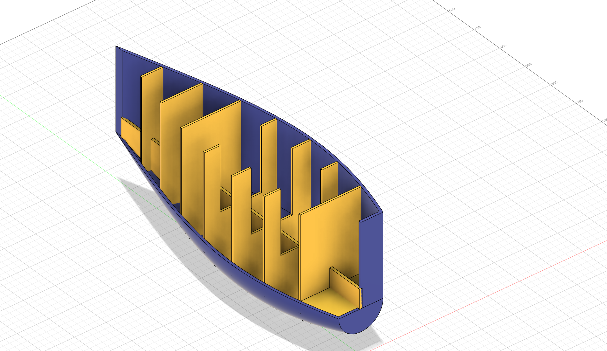
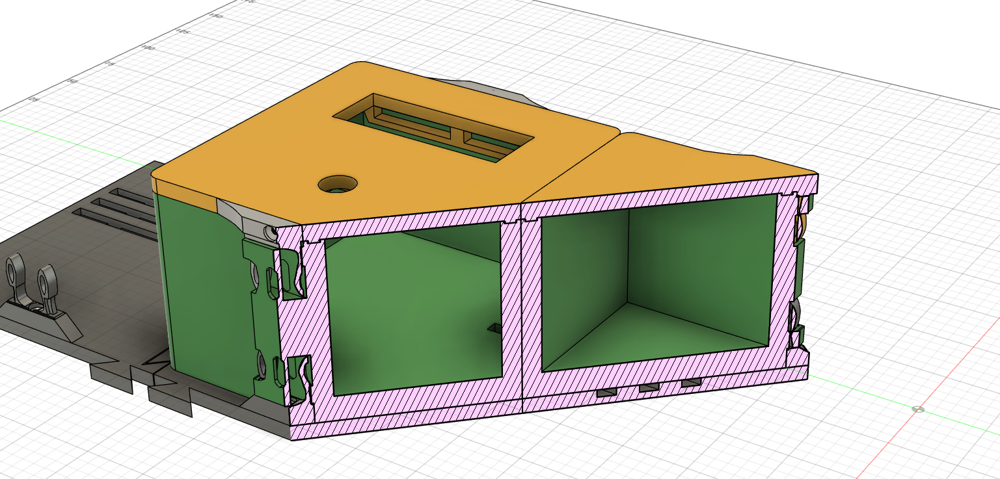
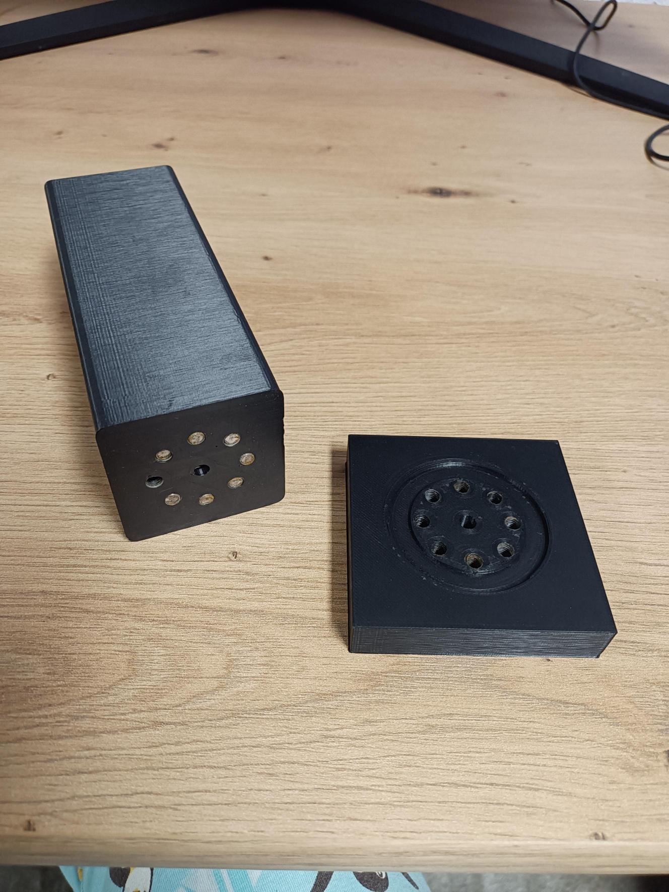
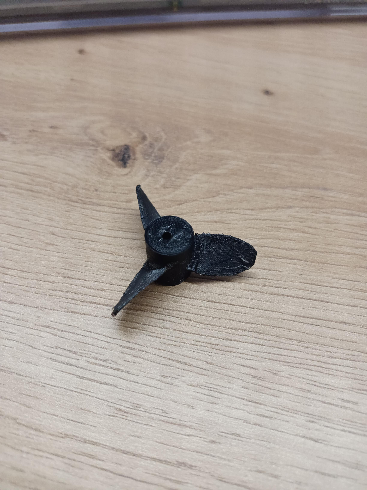

# Blok 1 a 2 – 3D tisk

## Cíl

Chtěl jsem získat zkušenosti, abych dokázal vytvořit plastové tělo pro můj projekt lodičky, zároveň jsem se chtěl zlepšit v 3D modeloví a zlepšit kvalitu mých výtisků. Modely jsem modeloval ve Fusionu a tisknul na 3D tiskárně od značky Prusa.

---

## Postup

### Blok č.1
- Studování a modelování dle kurzů
	- Měřil jsem a modeloval různé objekty
	- Učil jsem se za pomocí kurzů od Autodesku
	- [více inf. zde](/postup/kurz.md)

- Zkouška modelování lovidčky a lodního šroubu
	- Získával jsem zkušenosti  v modelování pro můj projekt
	- Vymodeloval jsem a vytisknul několik prototypů lodního šroubu
	- [více inf. zde](/postup/lodni.md)

### Blok č.2
- Zkouška modelování "*na zakázku*" 
	- Naměřil jsem součástky potřebné pro tento projekt
	- Modeloval jsem s ohledem na vůle, aby byla po vytištění nutná co nejmenší dodatečná úprava
	- Vzhledem k velmi krátkému termínu jsem musel nedostatek prototypů vyvažovat důkladnou úpravou modelu
	- [více inf. zde](/postup/zakazka.md)

- Tisknutí a testování z růžných filamentů
	- Upravoval jsem G-CODE v PrusaSliceru, abych mohl tisknout 2 filamenty najednou
	- Testoval jsem své prototypy a optimalizoval jejich vlastnosti i samotný proces tisku.
	- [více inf. zde](/postup/tesneni.md)

- Přemodelování lodního šroubu
	- Tentokrát jsem použil na model geometrii načtenou z aerodynamických článků
	- Dopočítal jsem si a vybral airfoil profil - NACA4412 
	- [více inf. zde](/postup/lodni2.md)

- 2.Modelování "*na zakázku*"
	- [Fingerscoot](/postup/finger.md)

- Modelování katamaránu 
---

## Výstupy

### Blok č.1
- [prezentace pokroku](https://canva.link/pp82prsnu6e1qxm)
- [obhajoba-prezentace](https://canva.link/det1xi7fvgvr9n9)

*Model servo motoru napojený na kloub*

*Model Lodního šroubu*

*Model lodě*

### Blok č.2
- [prezentace pokroku](https://canva.link/vry4nmxzg2cp10f)
- [obhajoba-prezentace](https://canva.link/citequc7jz43qs8)

*Model na "zakázku"*

*Zkušební spoj lodě*

*Prototyp lodního šroubu s airfoil profilem NACA4412*

---

## Reflexe

Realita mého tématu je zcela převrácená než jsem si myslel. Původně jsem si myslel, že modelování bude pro mě problém a samotné tisknutí bude "brnkačka." Nejtěžší pro mě bylo najít technické informace a *nenechat se nimi pohltit.*

---

## Teoretické pozadí (stručně)

3D tisk metodou FDM nanáší roztavený plast (filament) vrstvu po vrstvě. Digitální model ve formátu 3MF zpracuje slicer – software, který vygeneruje G-code (instrukce pro tiskárnu). Klíčové parametry jsou výška vrstvy, výplň a přítomnost supports pro přesahy. 
- [Podrobnosti teorie](../../teorie/teorie_1-2.md)

---

## [Zdroje](/zdroje.md)

- [https://help.prusa3d.com/cs/](https://help.prusa3d.com/cs/) – Knowledge Base Prusa, hlavně sekce o supports a adhesion
- [https://www.autodesk.com/learn/](https://www.autodesk.com/learn/ondemand/collection/self-paced-learning-for-fusion) – výukové lekce fusion
