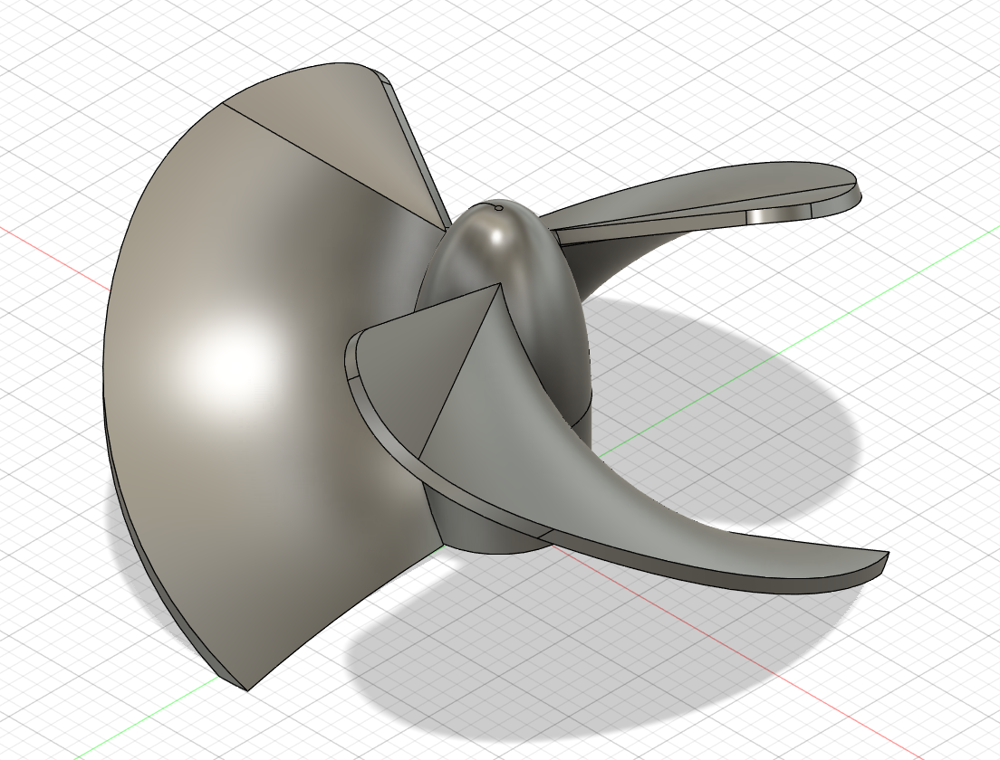

# Blok 1 a 2 – 3D tisk

## Cíl

Chtěl jsem získat zkušenosti, abych dokázal vytvořit plastové tělo pro můj projekt lodičky, zároveň jsem se chtěl zlepšit v 3D modeloví a zlepšit kvalitu mých výtisků. Modely jsem modeloval ve Fusionu a tisknul na 3D tiskárně od značky Prusa.

---

## Postup

### Blok č.1
- Nabíral jsem zkušenosti ve Fusionu 
	- Měřil jsem a modeloval různé objekty
	- Učil jsem se za pomocí kurzů od Autodesku
	- [více inf. zde](/postup/postup_1_1.md)

- Průběžně jsem se snažil modelovat věci týkající se mého projektu a to i samotnou lodičku
	- Získával jsem informace pro můj projekt
	- Vymodeloval jsem a vytisknul několik prototypů lodního šroubu
	- [více inf. zde](/postup/postup_1_2.md)

### Blok č.2
- Vyzkoušel jsem si vytvářet model "*na zakázku*" 
	- Naměřil jsem součástky potřebné pro tento projekt
	- Modeloval jsem s ohledem na vůle, aby byla po vytištění nutná co nejmenší dodatečná úprava
	- Vzhledem k velmi krátkému termínu jsem musel nedostatek prototypů vyvažovat důkladnou úpravou modelu
	- [více inf. zde](/postup/postup_1_3.md)

- Testoval jsem různé vlastnosti materiálů po tisku, které bych mohl použít na moji lodičku
	- Tisknul jsem z různých materiálů např. TPU
	- Upravoval jsem G-CODE v PrusaSliceru, abych mohl tisknout 2 filamenty najednou
	- Testoval jsem své prototypy a optimalizoval jejich vlastnosti i samotný proces tisku.
	- [více inf. zde](/postup/postup_1_4.md)

---

## Výstupy

### Blok č.1
- [prezentace pokroku](https://canva.link/baxa5j45svlp0cv)
- [obhajoba-prezentace](https://canva.link/inxs9ni55rl086u)

*Model  servo motoru napojený na kloub*

*Lodní šroub*

### Blok č.2
- [obhajoba-prezentace](https://canva.link/8hx0ta3q8c1sh4b)

---

## Reflexe

Překvapilo mě, jak rychle šlo navrhnout model v Tinkercadu – základní tvar jsem měla za hodinu. Složitější bylo porozumět, jak orientovat model na tiskové podložce a kdy jsou nutné supports. Příště bych přidala Brim od začátku pro lepší adhezi. Také bych zkusila víc perimetrů na místech, kde se stojánek ohýbá, aby byl pevnější.

---

## Teoretické pozadí (stručně)

3D tisk metodou FDM nanáší roztavený plast (filament) vrstvu po vrstvě. Digitální model ve formátu STL nebo 3MF zpracuje slicer – software, který vygeneruje G-code (instrukce pro tiskárnu). Klíčové parametry jsou výška vrstvy, výplň a přítomnost supports pro přesahy. 
[Podrobnosti](../../teorie/teorie_1-2.md)
---

## Zdroje

- [https://help.prusa3d.com/cs/](https://help.prusa3d.com/cs/) – Knowledge Base Prusa, hlavně sekce o supports a adhesion
- [https://www.autodesk.com/learn/](https://www.autodesk.com/learn/ondemand/collection/self-paced-learning-for-fusion) – výukové lekce Tinkercadu
- [https://www.printables.com/](https://www.printables.com/) – inspirace, prohlížela jsem podobné stojánky pro referenci
