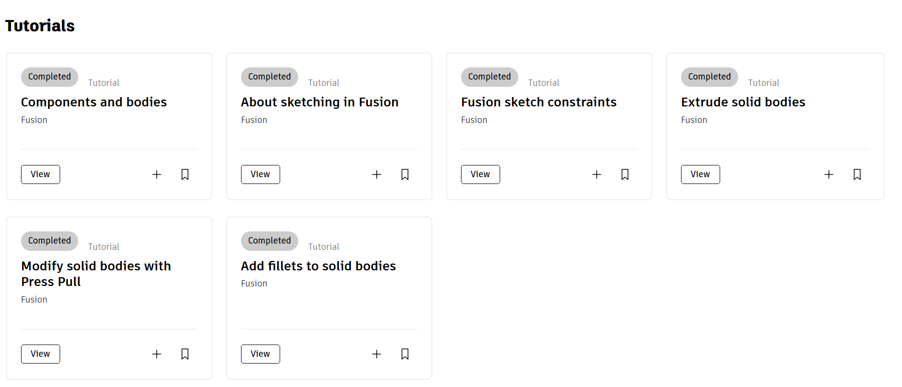

# Učení dle kurzů a reprodukce objektů

---

## Kurzy
- Kurzy od Fusion Autodesk [self-paced learning](https://www.autodesk.com/learn/ondemand/collection/self-paced-learning-for-fusion)
- Splnil jsem 2 sady lekcí tutorials a 3D modeling

- Jedna z lekcí v 3D modeling je tento model kola
s	- zde jsem se seznámil s základy 2D sketchů a extruzí
	- tuto lekci následovali další těžší funkce a modely

---

## Reprodukce modelů
- Měřil jsem součástky a následně snažil modelovat ě1:1
- Toto byla má 1. zkušenost s modelování podle naměřených parametrů, které nejsou ideální a musí se kompenzovat vůle
- Tyto modely následně budu využívat při konstrukci lodičky:

*Model elektromagnetu*

*Model motoru*

*Model  servo motoru napojený na kloub*

---

## [zpět](../blok_1-2.md)

