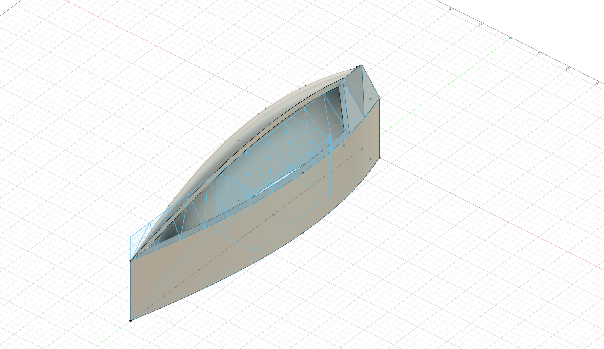
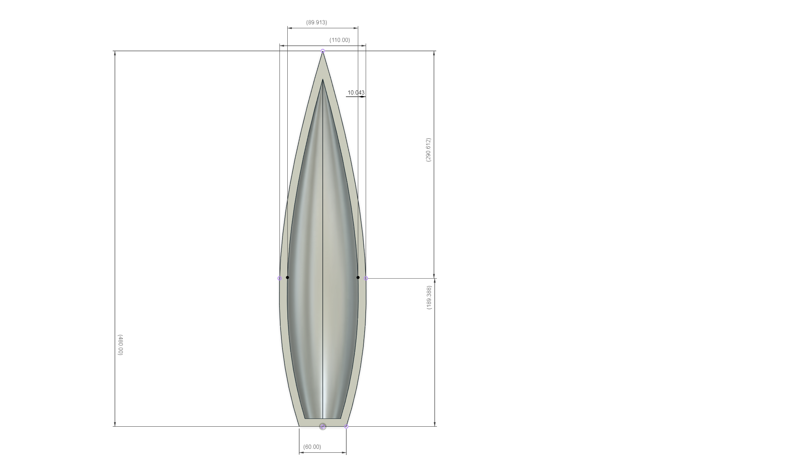
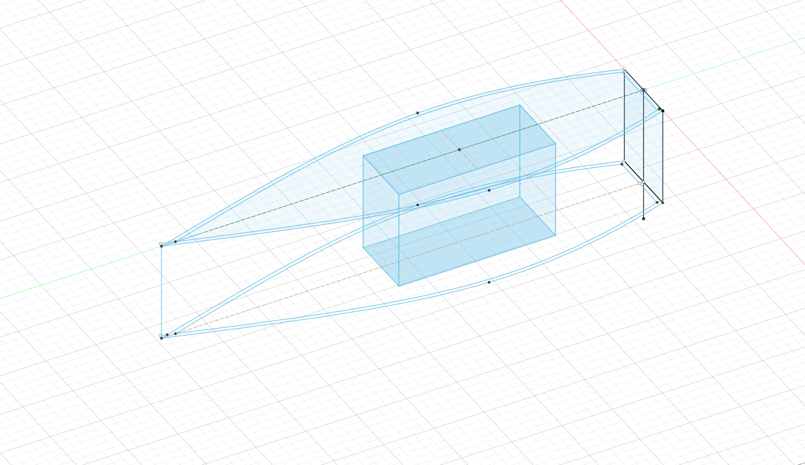
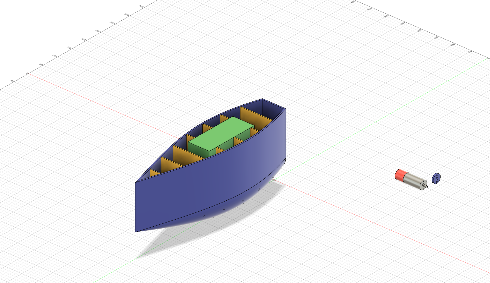
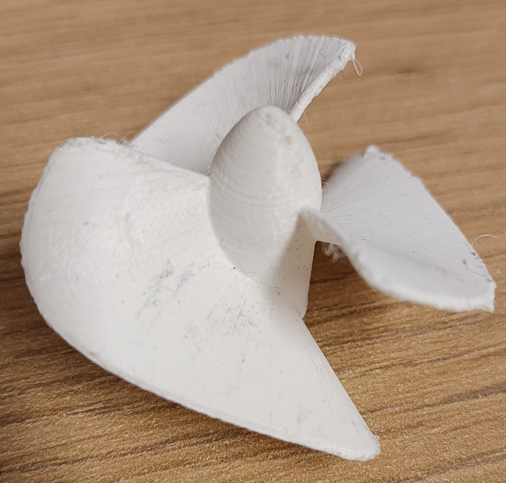
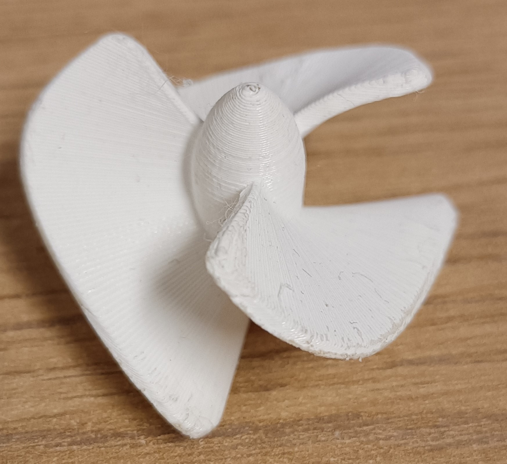
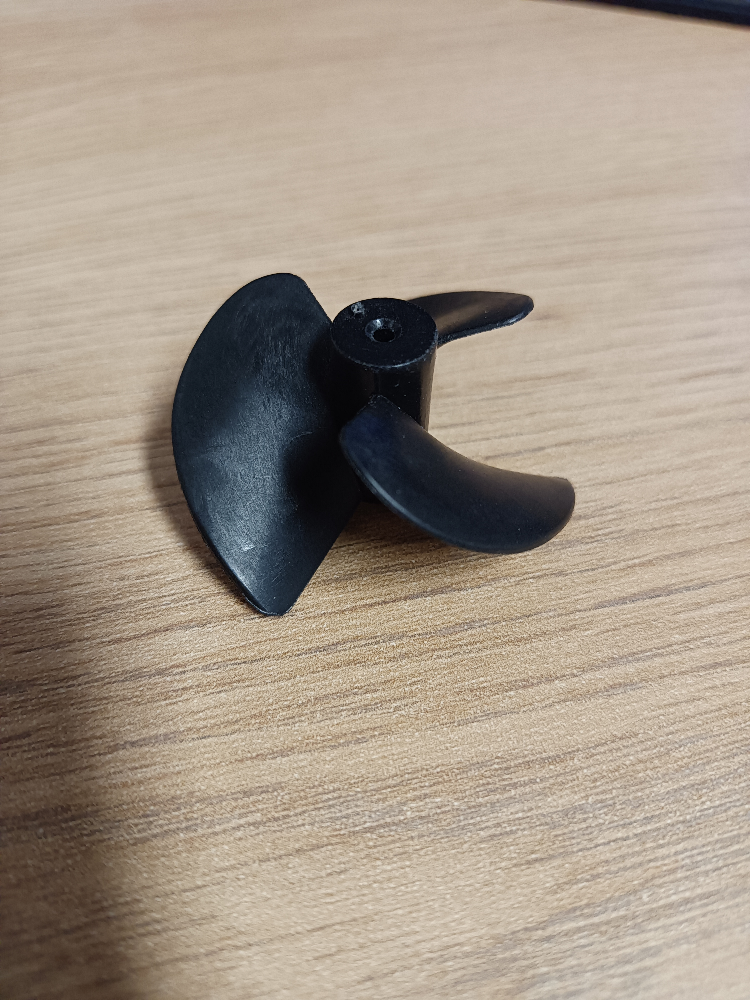
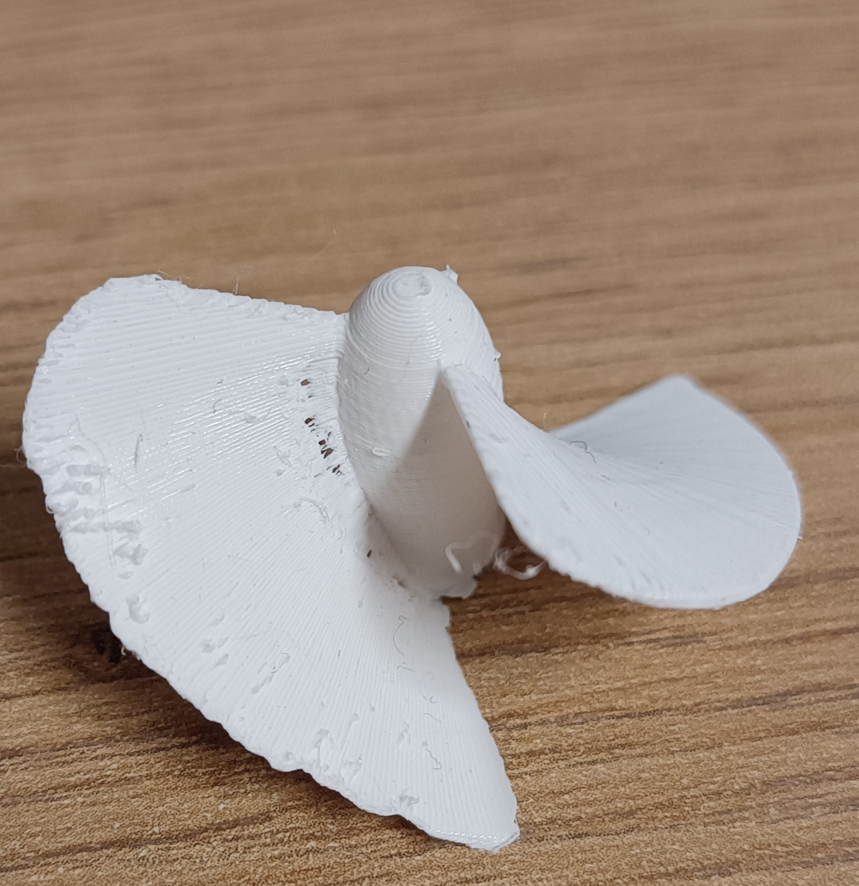
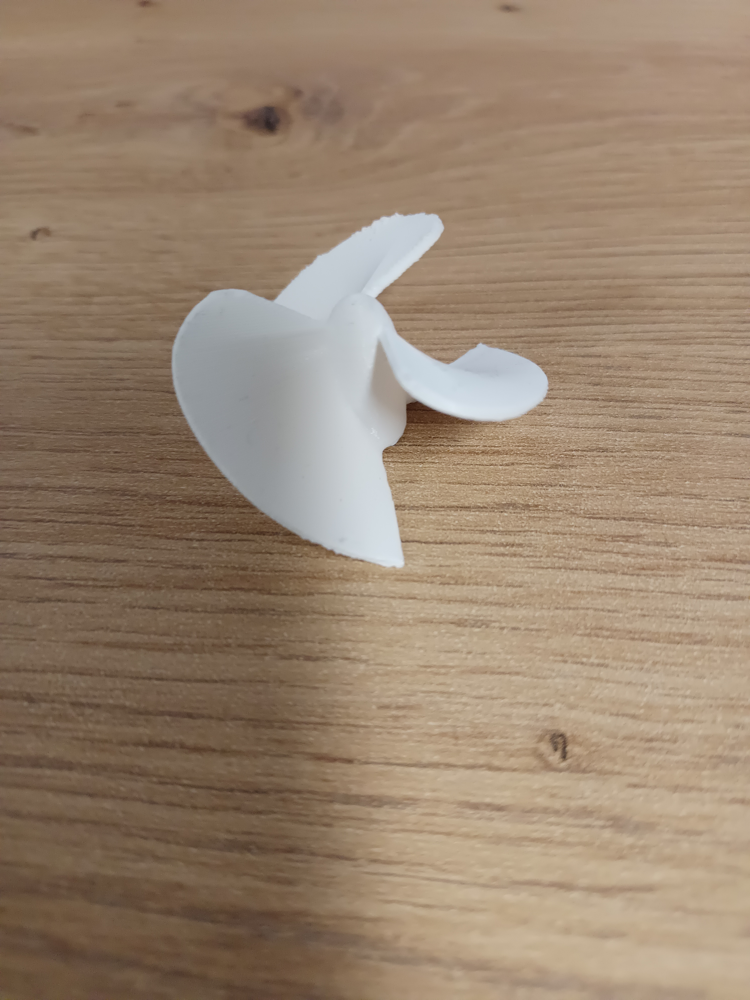

# Modelování lodičky a lodního šroubu

---

## Lodička

- Shromažďoval jsem informace o tom, jaký typ lodi vlastně chci a jak by měla vypadat
- První modely vznikaly bez hlubšího promýšlení funkčnosti — šlo hlavně o to zjistit, zda je dokážu vůbec vymodelovat 

*1. Model trupu katamaránu*

*2. Model*

- Pro další modely už jsem uvažoval o tvaru v závislosti na jejich účinky na proudění vody 
- Bohužel zatím jen z pohledu přímo na hladinu, protože my nešla namodelovat dolní zanedbaná část 

*Problémová dolní část*

*Pohled na hladinu*

*Sketch lodě*

- Modelování těchto prototypů mě bavilo natolik, že jsem si na nich vyzkoušel i strukturu lodě, jak v budoucnu bude vypadat
- Např. od předešlých modelů jsem přidal žebra a kýl
- Zároveň jsem se učil přidávat více objektů do projektu

*Žebra v modelu*

*Baterie a motor*

---

## Lodní šroub

- Rozhodl jsem se, že si své dovednosti v modelování procvičím na tvorbě lodního šroubu
- Zároveň jsem si na těchto prototypech vyzkoušel důkladný 3D tisk 
- První prototypy vznikaly, bez bližších informací o tvaru lodního šroubu

*1. Lodní šroub*

*Plastová hřídel*

- Od přidání plastové hřídele jsem u dalších modelů upustil, protože se ve šroubu zasekávala a ničila ho i sebe

*Model č.2*

- U dalších modelů jsem modeloval dle naměřených parametrů koupeného lodního šroubu

*Originál (koupený)*

*Model skoro stejný jako originál, ale moc tenký*

*Finální podoba tohoto pololetí*

## [zpět](../blok_1-2.md)