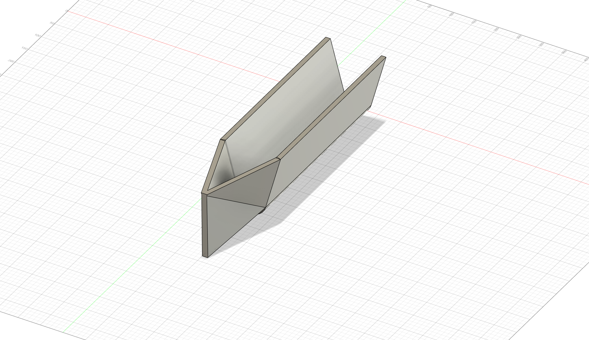
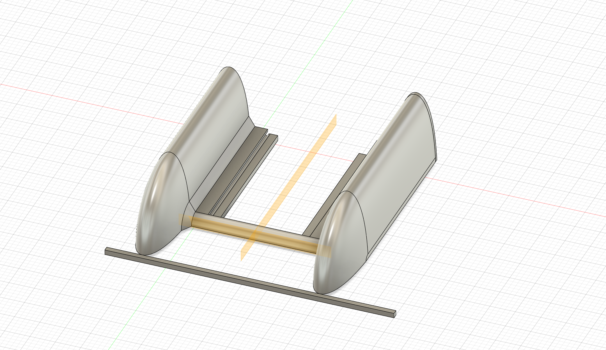

# Modelování lodičky a lodního šroubu

## Lodička
- Shromažďoval jsem informace o tom, jaký typ lodi vlastně chci a jak by měla vypadat
- První modely vznikaly bez hlubšího promýšlení funkčnosti — šlo hlavně o to zjistit, zda je dokážu vůbec vymodelovat 

př. Model trupu katamaránu

nebo

## [zpět](../blok_1-2.md)