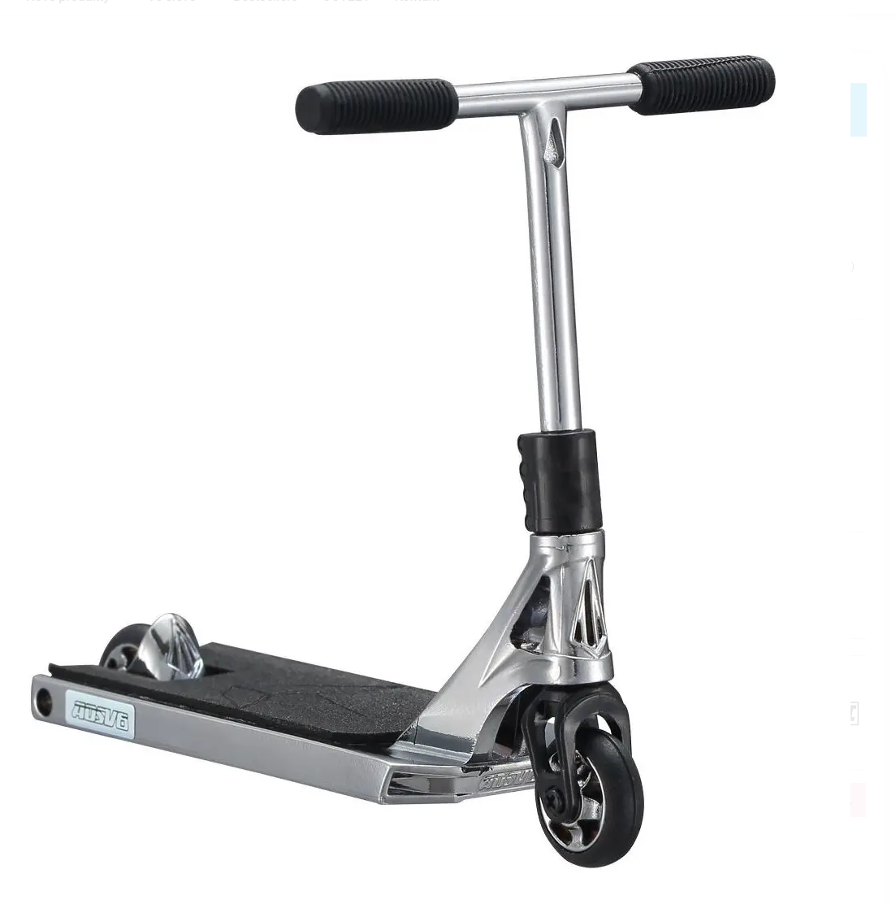
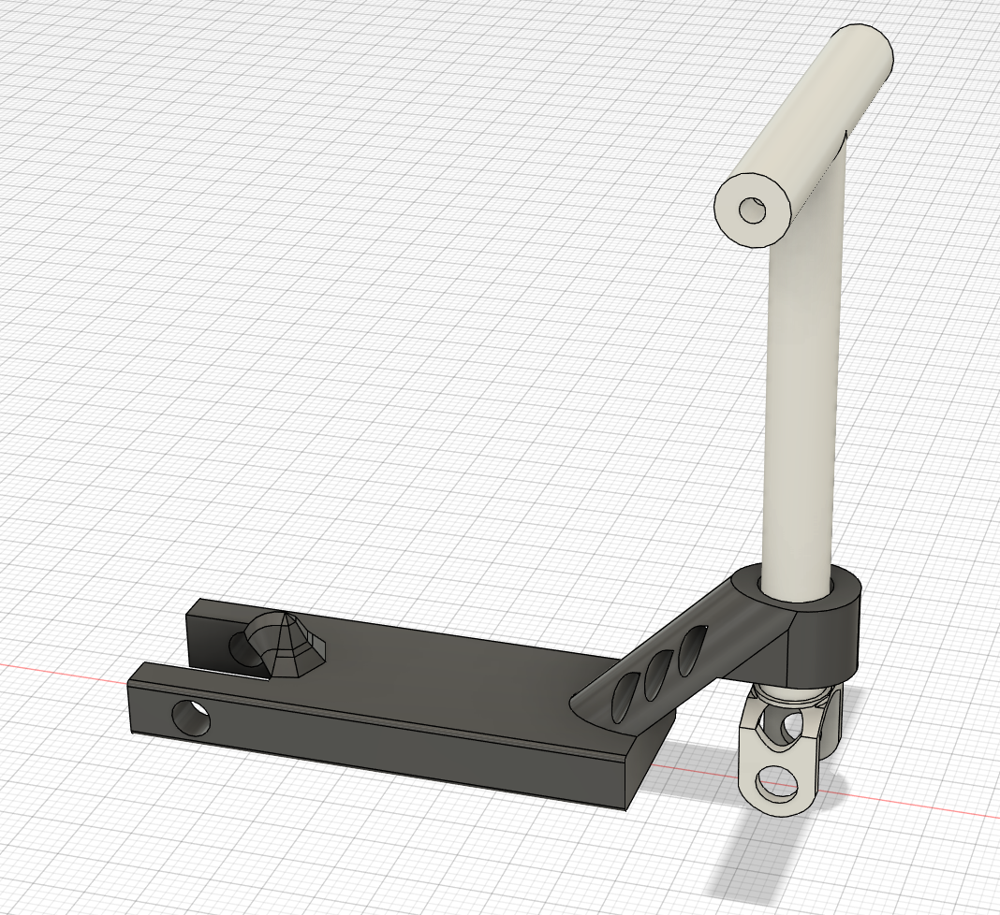
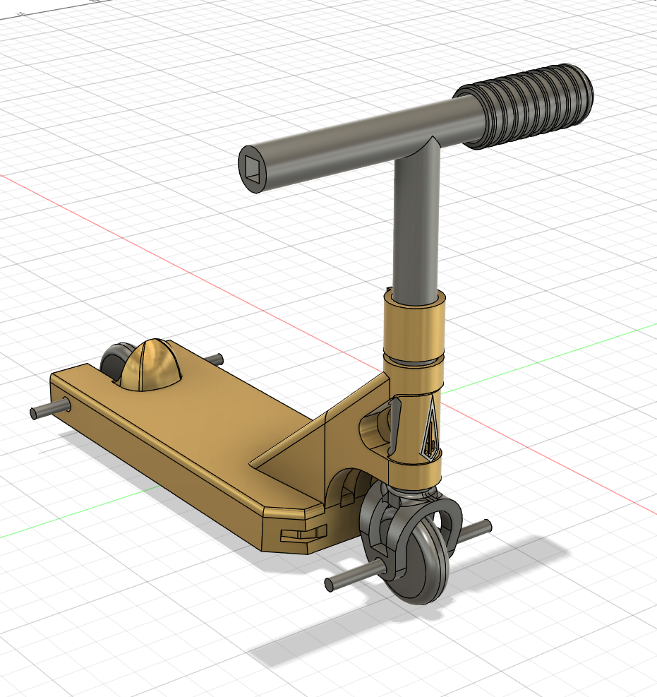

# Modelování Finger Scoot

## Cíl

Pokusil jsem se *rychle* dokázat, že takovýto produkt není složitý namodelovat následně i dát na trh tím, že ho namodeluji 
---

- Jediný opravdový problém byl nedostatek informací resp. detailů, které jsem schopen získat z obrázku a následně zrekonstruovat
- Tyto 2 modely zabraly okolo 10h

*Referenční obrázek*

*1. model s "klientem"*

*Finální produkt*

---

## [zpět](../prakt_1-2.md)

