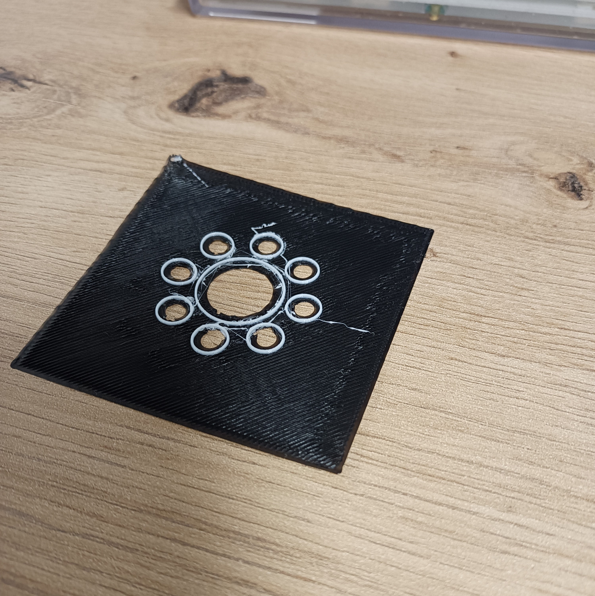
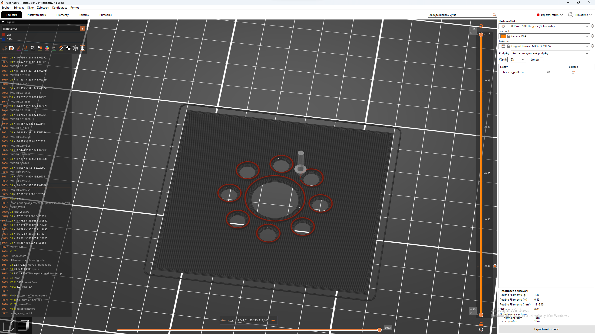
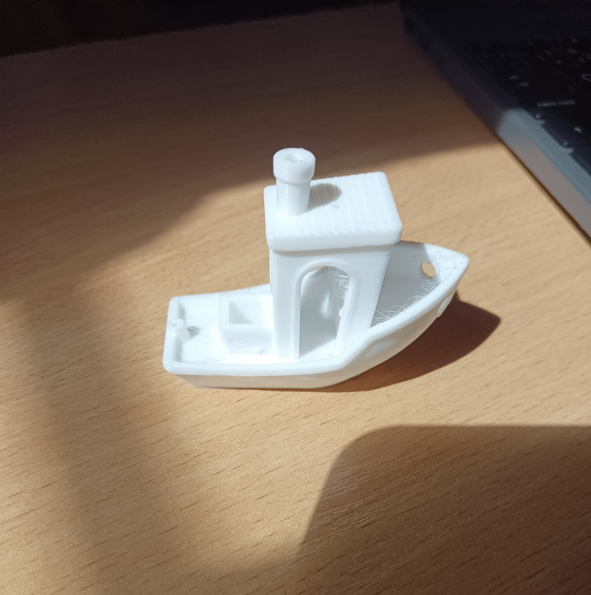
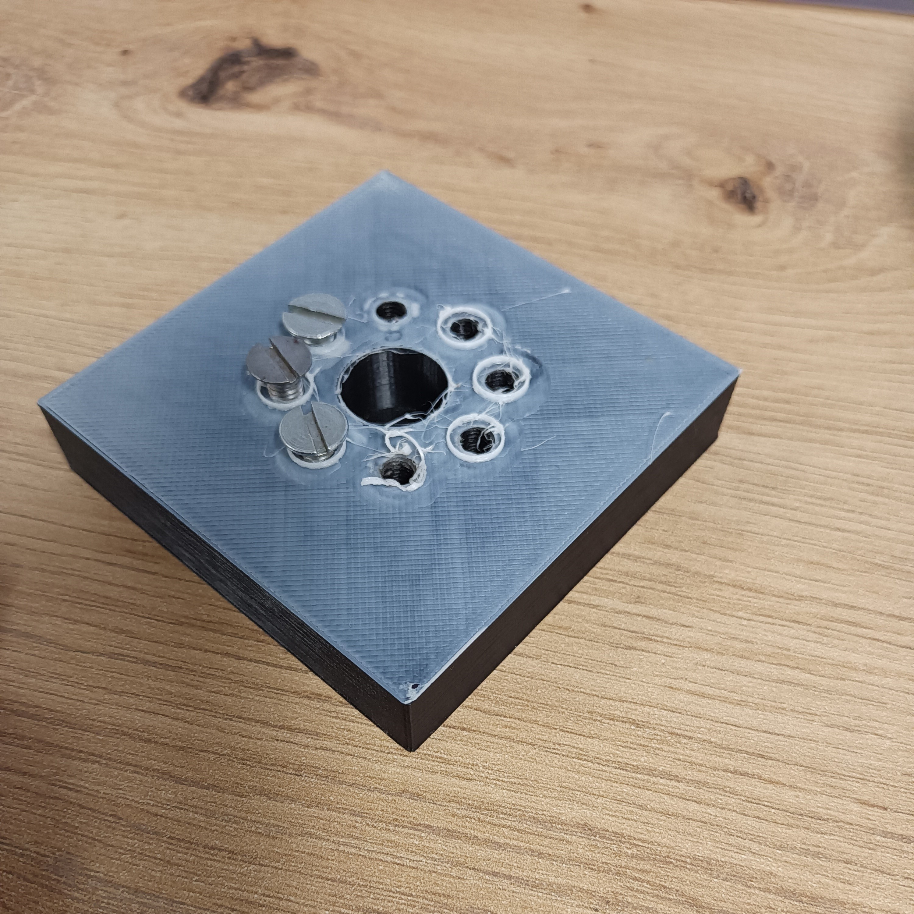
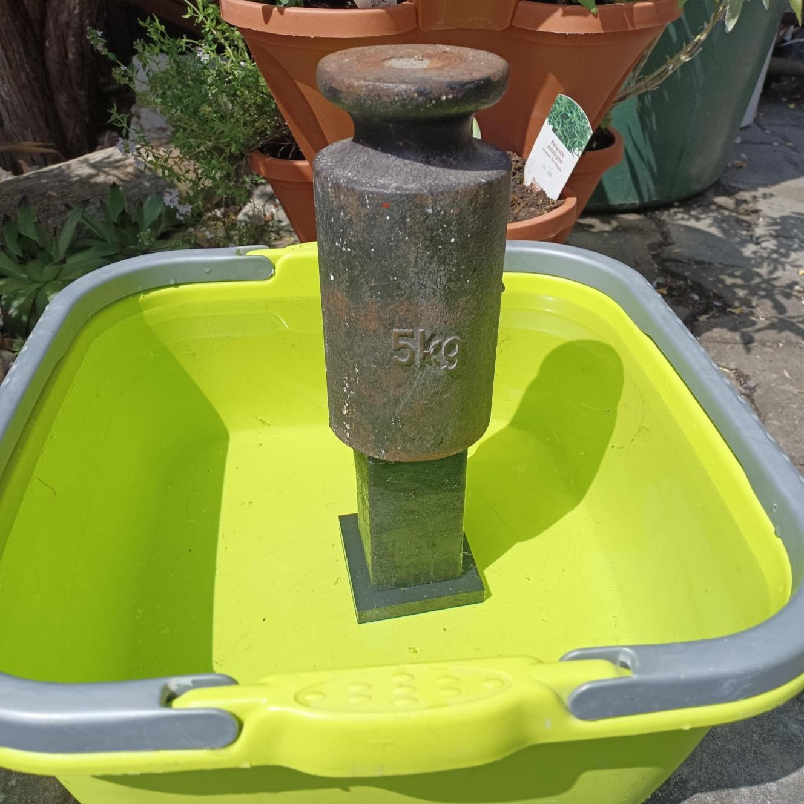

# Prototypy spojení s těsněním

## Cíl

Cílem bylo ověřit zda typ spojení, které jsem se rozhodl použít, dokáže vydržet dostatečně dlouho ve vodě při různé teplotě, nebo případně zvolit alternativní spojení.
Zároveň jsem chtěl zjistit zda jsem schopen vytisknout své vlastní vodotěsné těsnění z TPU. 

---

## Tisk s TPU

- Tisk s TPU je trochu zrádný v tom, že TPU je velmi přilnaví a „*lepí*“ se na desku, a proto jsem zvolil, že se zaměřím na tisk TPU na 2. plast resp. PLA, PETG
	- Mohl bych použít nějakou separační vrstvu jako je např. lepidlo, ale pro můj účel je to zbytečné.
- V době, kdy jsem toto testování dělal, nebyla pro můj typ tiskárny možnost tisknout dva filamenty zároveň s automatickým nastavením teploty atd.
- Nejdříve jsem na tuto realitu nebral ohled, ale po prvním tisku (úplné selhání) bylo jasné, že tento problém budu muset nějak vyřešit – a to pomocí manuální úpravy g-code

*Výtisk dvou plastů za pomocí úpravy g-code*

*Upravený g-code v PrusaSliceru*

*Testování TPU a kalibrování tiskárny pomocí Benchy*

---

## Testování těsnění

- Pro samotné testování jsem namodeloval sloup, který měl díry pro šrouby a průchozí otvor, společně s podložkou, kde jsem použil plastové šroubovice a kroužkové těsnění
- Nejdříve jsem se snažil o vytisknutí mého vlastního těsnění hned na podložku, což se ale ukázalo, že je zatím příliš velká obtíž na optimalizaci, a proto jsem prozatím použil kupované těsnící kroužky 
- Rozdíl mezi podložkou, která neměla rýhu pro těsnění a která měla, byla 5-10 minut a 7-10 hodin bez vody při hydrostatickém tlaku o výšce vodního sloupce 13cm

*Pokus o tpu těsnění hned na podložku*

*Vytisklý sloupec s podložkou s rýhou*

*Samotné testování vodotěsnosti spoje*

---

## [zpět](../prakt_1-2.md)
