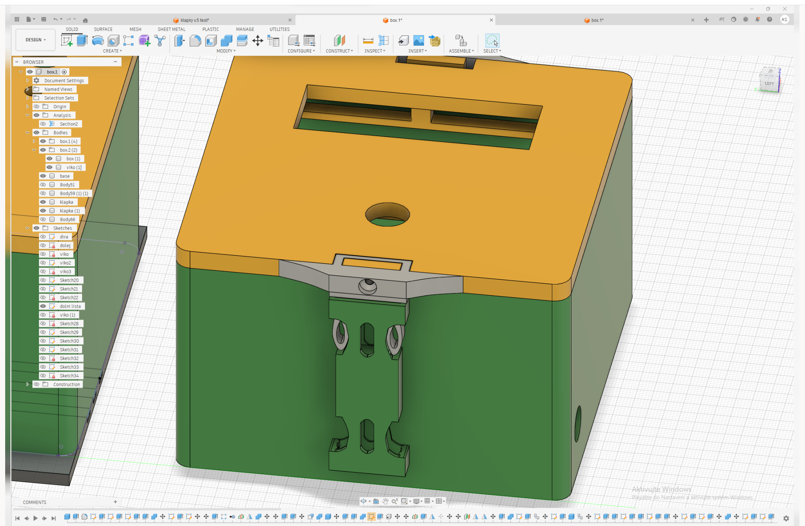

# Zakázka

## Cíl

Cílem této zakázky bylo vytvořit napodobeninu známé kooperační hry „Keep talking and nobody explodes“ s více prvky modularity. Pro tento projekt byl zároveň vymezen velmi omezený čas (necelé 2 týdny).

## Box

- Pro naměřený parametry komponentů (Arduino, led diody ...) jsem udal náležící rezervu pro kabeláž/pájení a vůle pro nehybnost 0.1-0.15mm
- Vytvořil jsem mechanický systém s jeho prvky př. rychloupínací klapky pro víka i desky modulů
- Zároveň jsem přidal modularitu skrz desky a jejich spojení k boxům

*Otevřený box s víkem a klapkami*

*Dva hotové moduly*

## Deska

- Přidal jsem do desky drážky s vodiči pro lehčí komunikaci a napájení individuálních modulů
- Recykloval jsem design klapek a přidal jej do desek
- Desky jsou také samy se sebou propojitelný pomocí konektorů

*samostatná centrální deska*

*Propojené desky*

## Tisk a po tiskový process

- Pro tisk dvou finálních boxů nezbylo mnoho času na optimalizaci, proto jsem využíval zkušenosti získané při tisku prvního z nich
-Ukázalo se například, že vertikálně orientované klapky byly příliš křehké, takže bylo nutné je vytisknout samostatně a dodatečně namontovat
-Tisk probíhal při 150% rychlosti, což vedlo k mírnému zmenšení plánovaných vůlí – drobné nepřesnosti však šlo snadno zbrousit

*Klakpy tisklé vertikálně*

*Klakpy montované do víka*

*Tisk v Prusa Sliceru*

---

## [zpět](../prakt_1-2.md)